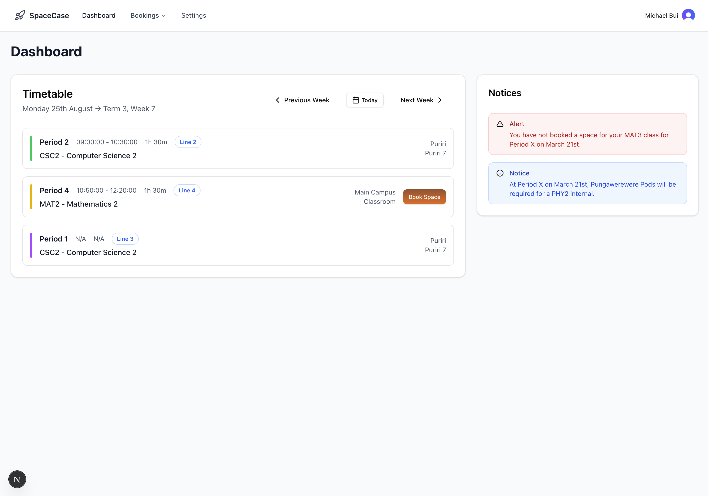

# SpaceCase

## Table of Contents

- [Background](#background)
- [Tech Stack](#tech-stack)
- [Features overview](#features-overview)
- [Development notes](#development-notes)
- [tl;dr](#tldr)

## Background

At my school, the campus is split into a few main teaching spaces called Kāingas. Back then, an entire Kāinga was used
as a single teaching space. But with population growth, the school split the Kāingas into smaller areas called Commons,
so each Kāinga now has multiple Commons with several rooms.

For example, the science block has Kāingas Waka and Pūkeko, each containing three Commons and two rooms each, alongside
dedicated science rooms like the Dry Lab and Wet Lab. There are also two all-purpose buildings with classrooms, some
reserved for subjects like food tech or art.

Because of these smaller areas, teachers needed a way to “book a room.” At first, they used Google Sheets and copied
bookings onto a whiteboard. Both methods caused problems. Teachers would forget to update the sheet or board, mistakes
could happen when copying information, and it was easy to double-book rooms or lose track of who booked what.

Teachers are assigned to subjects, and subjects are linked to the rooms they can use. Some classes have fixed rooms,
like Photography in the visual arts block or DVC in the DVC room. Others can book any available room in their allowed
Commons. The timetable is slot-based, so the same period number can be different times depending on the day. Learning
Advisor periods don’t need bookings, which makes scheduling a bit easier.

SpaceCase is my solution. It’s a web app where teachers can log in, see all the rooms in their Commons/areas, and book
what they need. If a teacher books the same room more than twice in a week, they provide a reason, which they can
reference later. It is a booking app designed for my school's specific needs.

I built it with Next.js and React, using Clerk for authentication and Supabase for the backend. Vercel hosts the app.

It helps teachers:

- View available rooms across school commons
- Create bookings for specific periods and dates
- See existing bookings and avoid conflicts
- Authenticate securely using school accounts

The project uses Clerk for authentication, Supabase for data storage and APIs, Tailwind CSS for styling, and Sentry for
monitoring.

## Tech Stack

- Next.js 15 (App Router)
- React 19
- TypeScript
- Tailwind CSS 4
- Clerk (authentication)
- Supabase (database + REST)
- Sentry (logging/monitoring)

## Features overview

- Authentication via Clerk
- Bookings API endpoints:
    - POST /api/bookings — create a booking with conflict detection
    - GET /api/bookings — list bookings with teacher, room, and subject details
    - GET /api/bookings/subjects — list subjects for the signed-in teacher
    - GET /api/bookings/rooms — list rooms and availability by common
    - GET /api/bookings/commons — list commons linked to a subject
- Webhooks: /api/webhooks — ingests Clerk user.created to seed teachers in Supabase
- The UI includes a landing page (Hero) and a dashboard entry point

## Development notes

> [!NOTE]
> I won’t be providing a local development environment because the project is tied to my school’s setup, has privacy and
> security concerns, and won’t run properly outside of it.

- Linting: `npm run lint` (Biome)
- Build: `npm run build`
- Start (prod): `npm start`
- Dev server uses Next.js Turbopack by default. Use `npm run devNoTurbopack` if you hit issues.

## tl;dr

At my school, teaching spaces called Kāingas got split into smaller Commons with multiple rooms because the school grew.
Science has Waka and Pūkeko, each with three Commons and a couple of rooms, plus dedicated labs. There are also two
all-purpose buildings with classrooms for certain subjects like food tech or art.

Booking rooms used to be messy. Teachers wrote in Google Sheets and copied to a whiteboard, which meant mistakes,
forgotten updates, and double bookings.

SpaceCase fixes this. Teachers log in, see which rooms they can use, and book them. If they book the same room more than
twice in a week, they add a reason they can reference later. Old bookings get archived automatically, keeping the
schedule clean and easy to manage.
